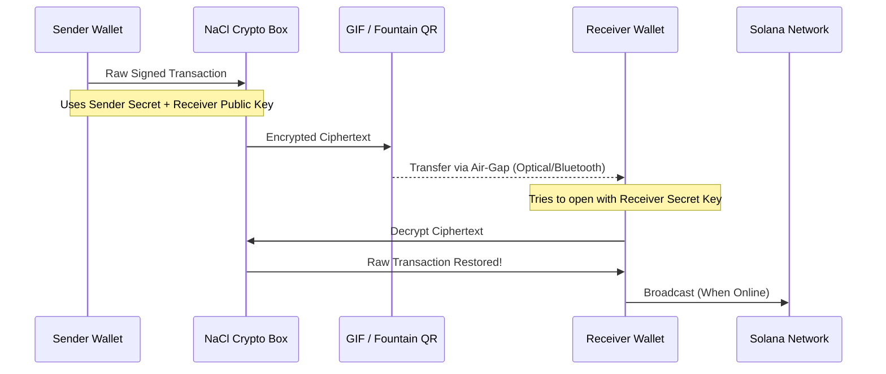
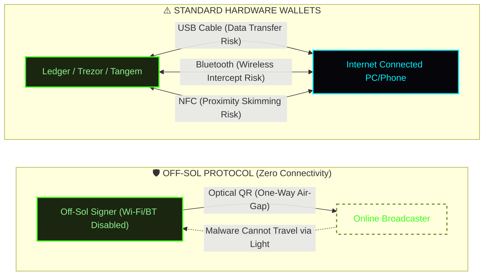
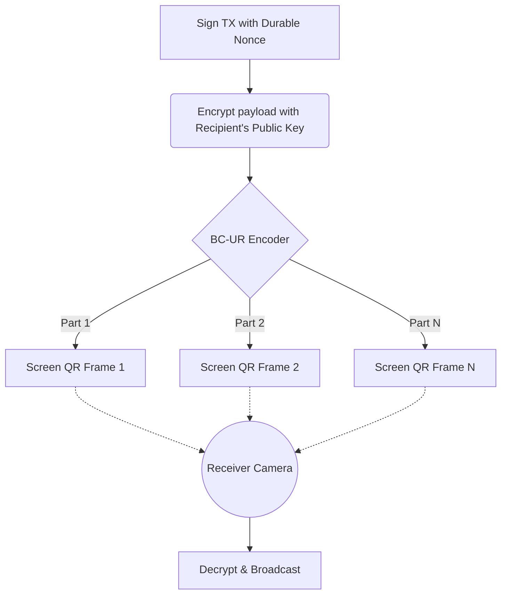
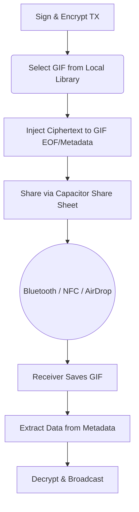

# Off-Sol: Unbreakable Offline Solana Wallet


Off-Sol is a futuristic, highly secure Mobile Wallet for Solana that allows you to sign and transfer transactions in completely **Air-Gapped (Zero-Connection)** environments. It utilizes Solana's Durable Nonce feature, the BC-UR hardware wallet standard, and advanced Asymmetric Steganography to transfer value without any active internet, Wi-Fi, or Cellular connection.

## 🌟 Core Features

1. **Air-Gapped Optical Transfer (Fountain QR):** Transfer SOL via high-speed, fluid animated QR codes using the `@ngraveio/bc-ur` protocol. No radio waves required.
2. **Meme-GIF Steganography:** Hide your encrypted Solana transactions invisibly inside the Metadata/EOF of funny Meme GIFs. Send the GIF via Bluetooth or NFC. The visual GIF remains completely untouched.
3. **Durable Nonce Architecture:** Prepare your offline ammunition beforehand. Sign transactions completely offline without worrying about blockhash expiration.
4. **Capacitor Native Integration:** Compiles to a fully native Android APK with direct access to hardware cameras and system Share Sheets.

---

## 🔒 Security Architecture (Military Grade)

Off-Sol employs an uncompromising approach to transaction security, ensuring that your funds are safe even if your transaction payloads are intercepted by hackers.

### Asymmetric Encryption (Libsodium / TweetNaCl)
Every transaction—whether displayed on screen as a QR or embedded in a GIF—is protected by **X25519 Curve Cryptography**.

1. **Key Exchange:** The sender's Ed25519 Secret Key and the recipient's Ed25519 Public Key (Wallet Address) are cryptographically converted to Curve25519.
2. **Payload Locking:** The raw Solana transaction is encrypted using `libsodium.crypto_box_easy`. 
3. **Impenetrable:** The resulting encrypted payload can **ONLY** be decrypted by the intended recipient's Private Key. If a GIF is sent to the wrong Bluetooth device, or intercepted by a hacker, it is mathematically impossible for them to extract or broadcast the transaction.



---

## 📡 Off-Sol vs Standard Hardware Wallets

Off-Sol relies on a strict "Optical Air-Gap" to ensure your private keys are completely isolated. To understand why this is necessary, here is a visual comparison between how standard hardware wallets connect to the internet versus how Off-Sol operates.



### Why Other Methods Carry Risks:
1. **USB Cables:** They establish a two-way physical data channel. Sophisticated malware on a compromised PC can attempt to send malicious payloads directly to the hardware device.
2. **Bluetooth:** Wireless signals can be intercepted, spoofed, or subjected to "Man-in-the-Middle" (MitM) attacks by devices in proximity.
3. **NFC:** While requiring close contact, it still acts as a two-way communication protocol susceptible to specialized skimming hardware or rogue applications on the mobile device.

### The Off-Sol Advantage:
- **True Air-Gap:** Off-Sol uses only your device's screen and camera. There is no physical connection, no wireless radio signal, and no two-way data handshake.
- **One-Way Transmission:** The transaction data flows strictly in one direction: from the offline device (screen) to the online device (camera). It is physically impossible for the internet-connected device to send a virus "back" through the camera lens.

---

## 🏗️ Technical Flows

### 1. Fountain QR (Optical) Flow
For face-to-face transfers.



### 2. Meme-GIF (Steganography) Flow
For offline transfers via files (Bluetooth/NFC).



---

## 🚀 Getting Started

### Prerequisites
- Node.js (v18+)
- Android Studio (For APK compilation)
- Vite

### Development
```bash
npm install
npm run dev
```

### Build APK (Android)
```bash
npm run build
npx cap sync android
cd android
./gradlew assembleDebug
```
*The compiled APK will be available in `android/app/build/outputs/apk/debug/`.*

---
*Built with ❤️ for the Solana Ecosystem.*
